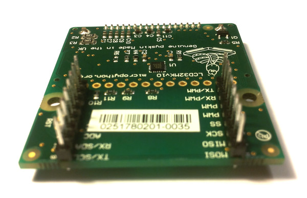

LCD və touch-sensor(rus dilində: сенсорный датчик)
=============================

LCD və touch-sensor-un birləşdirilməsi və istifadəsi

.. image:: img/skin_lcd_1.jpg
    :alt: pyboard with LCD skin
    :width: 250px

Aşağıdakı videoda LCD-yə başlıqların qoşulması göstərilmişdir.
Videonun sonunda isə, LCD-nin pyboard-da necə düzgün şəkildə qoşulmalı olduğu göstərilmişdir.

.. raw:: html

    <iframe style="margin-left:3em;" width="560" height="315" src="http://www.youtube.com/embed/PowCzdLYbFM?rel=0" frameborder="0" allowfullscreen></iframe>

LCD-nin istifadəsi
-------------

To get started using the LCD, try the following at the Micro Python prompt.
LCD ilə işə başlamaq üçün, Micro Python prompt-da aşağıdakını sınayın.
Əmin olun ki, LCD pyboard-a məhz şəkildə göstərildiyi kimi qoşulmuşdur: ::

    >>> import pyb
    >>> lcd = pyb.LCD('X')
    >>> lcd.light(True)
    >>> lcd.write('Hello uPy!\n')

Aşağıdakı koddan istifadə etməklə sadə animasiya yarada bilərsiniz: ::

    import pyb
    lcd = pyb.LCD('X')
    lcd.light(True)
    for x in range(-80, 128):
        lcd.fill(0)
        lcd.text('Hello uPy!', x, 10, 1)
        lcd.show()
        pyb.delay(25)

Touch sensor-un istifadəsi
----------------------

Touch-sensor məlumatları oxumaq üçün siz I2C marşrutundan(şinindən) istifadə etməlisiniz.
MPR121 kapasiteli(red. ~ Türkiyə türkçəsi) touch sensor-in adresi 90-dır.

Sınamaq üçün: ::

    >>> import pyb
    >>> i2c = pyb.I2C(1, pyb.I2C.MASTER)
    >>> i2c.mem_write(4, 90, 0x5e)
    >>> touch = i2c.mem_read(1, 90, 0)[0]

İlk sətr, I2C obyektini yaradır, ikinci sətr 4 touch sensoru aktivləşdirir,
üçüncü sətr "touch status"-u oxuyur
və ``touch`` dəyişəni isə 4 touch düyməciklərdən gələn məlumatı özündə saxlayır(A, B, X, Y).

Çox sadə driver `burada <http://micropython.org/resources/examples/mpr121.py>`_ artıq mövcuddur,
hansı ki, hədd və titrəmə parametrlərini təyin etməyə və toxunma statuslarının həmçinin, elektrodların gərginlik səviyyəsini oxumağa imkan verir. Bu proqramı pyboard-a köçürün
(flash və ya SD kartın baş qovluğuna və ya ``lib/`` qovluğuna) və çalışdırmağa cəhd edin::

    >>> import pyb
    >>> import mpr121
    >>> m = mpr121.MPR121(pyb.I2C(1, pyb.I2C.MASTER))
    >>> for i in range(100):
    ...   print(m.touch_status())
    ...   pyb.delay(100)
    ...

Bu ardıcıllıqla bütün elektrodların toxunma statusunu çap edəcəkdir.
Növbə ilə hər birinə toxunmağa çalışın.

Nəzərə alın ki, əgər LCD əlavəni Y vəziyyətində qoysanız
I2C şinini aşağıdakı kimi inisiallaşdırmalısınız.::

    >>> m = mpr121.MPR121(pyb.I2C(2, pyb.I2C.MASTER))

Həmçinin `burada <http://micropython.org/resources/examples/lcddemo.py>`_ LCD və toxunma sensorlarını
birlikdə istifadə edən demo ilə tanış ola bilərsiniz.
