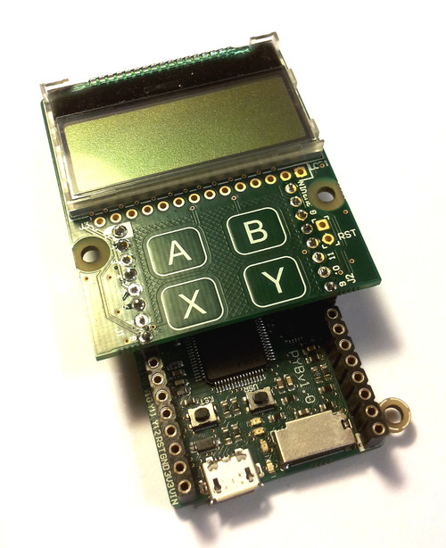

LCD və touch-sensor(rus dilində: сенсорный датчик)
=============================

LCD və touch-sensor-un birləşdirilməsi və istifadəsi

Aşağıdakı videoda LCD-yə başlıqların qoşulması göstərilmişdir.
Videonun sonunda isə, LCD-nin pyboard-da necə düzgün şəkildə qoşulmalı olduğu göstərilmişdir.

.. raw:: html

    <iframe style="margin-left:3em;" width="560" height="315" src="http://www.youtube.com/embed/PowCzdLYbFM?rel=0" frameborder="0" allowfullscreen></iframe>

LCD-nin istifadəsi
-------------

To get started using the LCD, try the following at the Micro Python prompt.
LCD ilə işə başlamaq üçün, Micro Python prompt-da aşağıdakını sınayın.
Əmin olun ki, LCD pyboard-a məhz şəkildə göstərildiyi kimi qoşulmuşdur: ::

    >>> import pyb
    >>> lcd = pyb.LCD('X')
    >>> lcd.light(True)
    >>> lcd.write('Hello uPy!\n')

Aşağıdakı koddan istifadə etməklə sadə animasiya yarada bilərsiniz: ::

    import pyb
    lcd = pyb.LCD('X')
    lcd.light(True)
    for x in range(-80, 128):
        lcd.fill(0)
        lcd.text('Hello uPy!', x, 10, 1)
        lcd.show()
        pyb.delay(25)

Touch sensor-un istifadəsi
----------------------

Touch-sensor məlumatları oxumaq üçün siz I2C marşrutundan(şinindən) istifadə etməlisiniz.
MPR121 kapasiteli(red. ~ Türkiyə türkçəsi) touch sensor-in adresi 90-dır.

Sınamaq üçün: ::

    >>> import pyb
    >>> i2c = pyb.I2C(1, pyb.I2C.MASTER)
    >>> i2c.mem_write(4, 90, 0x5e)
    >>> touch = i2c.mem_read(1, 90, 0)[0]

İlk sətr, I2C obyektini yaradır, ikinci sətr 4 touch sensoru aktivləşdirir,
üçüncü sətr "touch status"-u oxuyur
və ``touch`` dəyişəni isə 4 touch düyməciklərdən gələn məlumatı özündə saxlayır(A, B, X, Y).

<<<<<<< HEAD
Çox sadə driver artıq mövcuddur [here](/static/doc/examples/mpr121.py)
=======
There is a simple driver `here <http://micropython.org/resources/examples/mpr121.py>`_
>>>>>>> bfb18a714ba03571575e2d715cbc409afeb94e54
which allows you to set the threshold and debounce parameters, and
easily read the touch status and electrode voltage levels.  Copy
this script to your pyboard (either flash or SD card, in the top
directory or ``lib/`` directory) and then try::

    >>> import pyb
    >>> import mpr121
    >>> m = mpr121.MPR121(pyb.I2C(1, pyb.I2C.MASTER))
    >>> for i in range(100):
    ...   print(m.touch_status())
    ...   pyb.delay(100)
    ...

Bu ardıcıllıqla bütün elektrodların toxunma statusunu çap edəcəkdir.
Növbə ilə hər birinə toxunmağa çalışın.

Nəzərə alın ki, əgər LCD əlavəni Y vəziyyətində qoysanız
I2C şinini aşağıdakı kimi inisiallaşdırmalısınız.::

    >>> m = mpr121.MPR121(pyb.I2C(2, pyb.I2C.MASTER))

<<<<<<< HEAD
Həmçinin [burada](/static/doc/examples/lcddemo.py) LCD və toxunma sensorlarını
birlikdə istifadə edən demo ilə tanış ola bilərsiniz.
=======
There is also a demo which uses the LCD and the touch sensors together,
and can be found `here <http://micropython.org/resources/examples/lcddemo.py>`_.
>>>>>>> bfb18a714ba03571575e2d715cbc409afeb94e54
